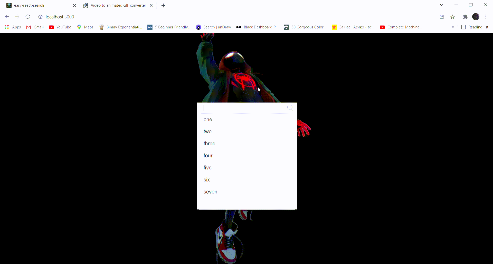

# easy-react-search

> A library to use easy search


## Install

```bash
npm install --save search-data-react
```

## Usage

```jsx
import React, { useState } from 'react'

// importing styles
import 'search-data-react/dist/index.css'
import { EasySearch } from 'search-data-react'
const App = () => {
  const [choosedValue,setChoosedValue] = useState(''); 
  const [enteredValue,setOnEnterPress] = useState('');
  return (
    <EasySearch dataString='one,two,three,four' setChoosedValue={setChoosedValue} setOnEnterPress={setOnEnterPress}/>
  )
}
```
>data string must be comma seperated values

>choosedValue is the value that user click

>enteredValue is the value of input when user click enter


## License

MIT © [Hetu1107](https://github.com/Hetu1107)
